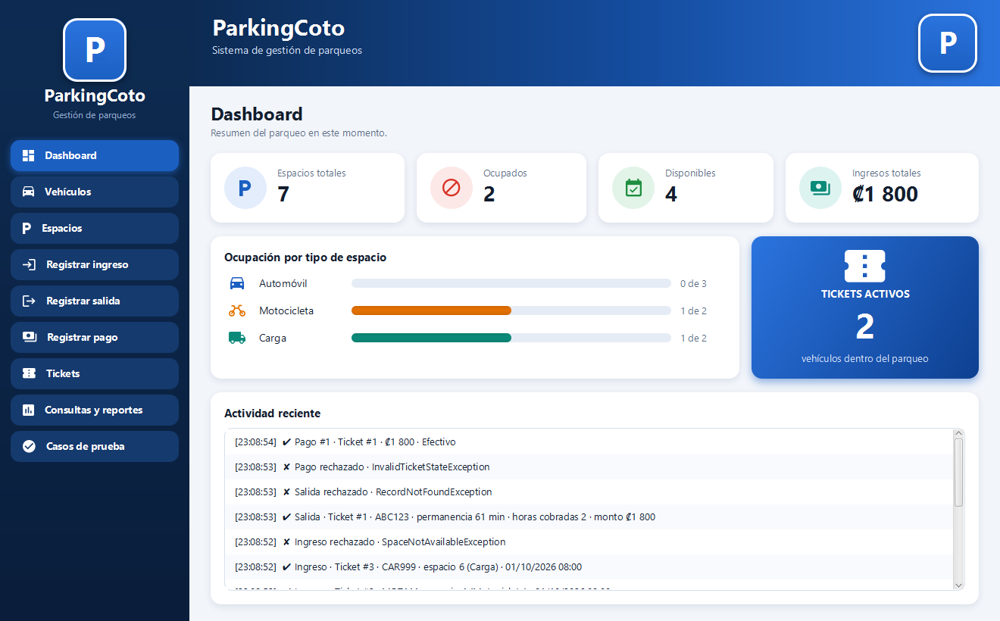
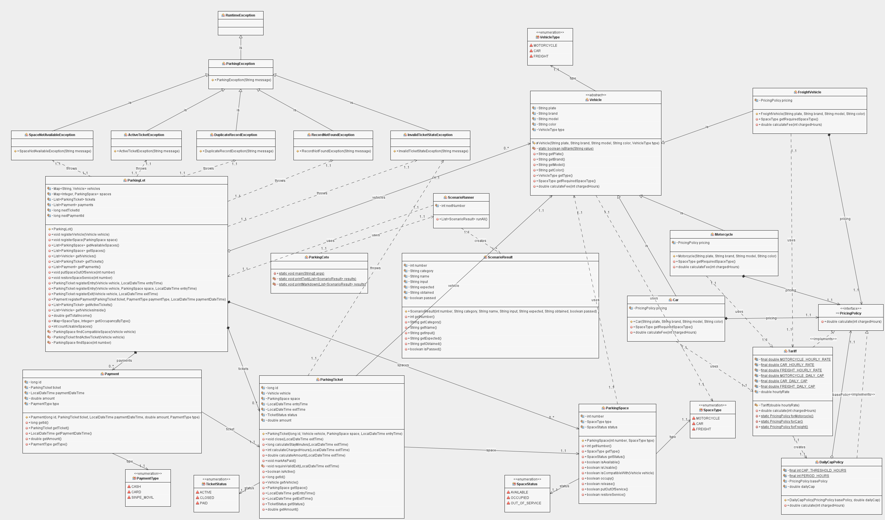

# Parking Coto

Sistema de gestión de un parqueo privado con cobro por hora, hecho en Java con programación orientada a objetos y una interfaz gráfica en JavaFX. Proyecto 2 del curso EIF400 · Paradigmas de Programación.

Controla vehículos, espacios, ingresos, tickets, salidas, cobro, pagos, ocupación e ingresos, repartiendo las responsabilidades entre las clases del dominio en lugar de concentrar la lógica en una sola.



## Requisitos

- **JDK 8 de Oracle** (ya trae JavaFX) **o JDK 17 o superior**. Probado con 8 y 21: el código se compila para Java 8, así que corre en ambos.
- **Maven 3.9 o superior**. NetBeans ya lo trae integrado, no hace falta instalarlo aparte.
- Opcional: **NetBeans** para ejecutar con un clic y abrir el diagrama UML, y **Scene Builder** para editar las pantallas (archivos `.fxml`).

## Cómo ejecutar

Todos los comandos se escriben dentro de la carpeta `parking-coto`.

### 1. La aplicación con interfaz gráfica

Con NetBeans: abrir la carpeta `parking-coto` como proyecto y usar *Run Project* (F6). Funciona con el JDK 8 y con el 17 o superior.

Desde la terminal con JDK 17 o superior (descarga JavaFX la primera vez, necesita internet):

```bash
mvn javafx:run
```

Desde la terminal con JDK 8 de Oracle, que ya trae JavaFX:

```bash
mvn compile
java -cp target/classes cr.ac.una.parking.coto.ParkingCoto
```

### 2. Los casos de prueba en consola (no necesita JavaFX)

```bash
mvn compile
java -Dstdout.encoding=UTF-8 -cp target/classes cr.ac.una.parking.coto.ParkingCoto --console
```

Con `--markdown` en lugar de `--console` imprime los casos como tabla Markdown, que es como se generó [docs/tabla-pruebas.md](docs/tabla-pruebas.md).

### 3. Las pruebas automáticas (JUnit)

```bash
mvn test
```

Con NetBeans: clic derecho sobre el proyecto y *Test*. Resultado esperado: 61 pruebas, 0 fallos.

## Cómo usar la interfaz en una demostración

El menú lateral tiene un paso por pantalla:

1. **Vehículos** → *Cargar datos de ejemplo* registra 7 espacios y 7 vehículos.
2. **Registrar ingreso** → elige el vehículo y escribe la fecha y hora de entrada. Se asigna automáticamente un espacio compatible. Marcando *Elegir el espacio manualmente* se pueden probar los rechazos por espacio ocupado, fuera de servicio o incompatible.
3. **Registrar salida** → los atajos (`+1 min`, `+60 min`, `+61 min`, `+2 h`, `+11 h`, `+25 h`) ponen la hora de salida a ese tiempo después de la entrada, así se muestran todas las permanencias sin esperar. Muestra horas cobradas y monto.
4. **Registrar pago** → cobra el ticket cerrado. Un ticket que sigue activo se rechaza.
5. **Tickets** y **Consultas y reportes** → tickets activos e historial, vehículos dentro, espacios disponibles, pagos, ocupación por tipo e ingresos totales.
6. **Casos de prueba** → *Ejecutar casos de prueba* corre los 15 casos obligatorios del enunciado y 4 adicionales, y compara lo esperado con lo obtenido.

Cada operación muestra un aviso verde si funcionó, o uno rojo con el nombre de la excepción de negocio si una regla la rechazó. El panel *Actividad reciente* del Dashboard guarda la secuencia.

Si se copian `logo.png` y `banner.png` en `parking-coto/src/main/resources/cr/ac/una/parking/coto/ui/`, reemplazan el logo del menú y la imagen del banner.

## Estructura del proyecto

```text
Parking-Coto-POO/
├── README.md
├── docs/
│   ├── diagrama-uml.png          Diagrama de clases
│   ├── tabla-pruebas.md          Casos con resultado esperado y obtenido
│   ├── InformeProyecto.md
│   └── capturas/                 Capturas de la interfaz
├── ParkingCotoUML/               Proyecto de easyUML (NetBeans)
│   └── Class Diagrams/ParkingCoto.cdg
└── parking-coto/
    ├── pom.xml
    └── src/
        ├── main/java/cr/ac/una/parking/coto/
        │   ├── ParkingCoto.java  Punto de entrada
        │   ├── ParkingLot.java   Coordina colecciones y flujo del negocio
        │   ├── model/            Vehicle, Car, Motorcycle, FreightVehicle, ParkingSpace, ParkingTicket, Payment
        │   ├── pricing/          PricingPolicy, Tariff, DailyCapPolicy
        │   ├── enums/            VehicleType, SpaceType, SpaceStatus, TicketStatus, PaymentType
        │   ├── exception/        ParkingException y las excepciones de reglas de negocio
        │   ├── scenario/         ScenarioRunner, ScenarioResult, SampleData
        │   └── ui/               Interfaz JavaFX: ParkingApp y los controllers
        ├── main/resources/cr/ac/una/parking/coto/ui/   Pantallas .fxml y estilos .css
        └── test/java/cr/ac/una/parking/coto/           Pruebas JUnit
```

## Diseño



- **Herencia y polimorfismo.** `Vehicle` es abstracta y `Car`, `Motorcycle` y `FreightVehicle` la especializan: cada una define el tipo de espacio que necesita y su política de cobro. Ningún código pregunta por el tipo concreto: `ParkingTicket` solo llama a `vehicle.calculateFee(horas)`.
- **Tarifas en un solo lugar.** `Tariff` contiene las tres tarifas por hora y los tres topes diarios, y nada más define montos.
- **El tope diario evoluciona sin condiciones dispersas.** `DailyCapPolicy` envuelve cualquier `PricingPolicy` (patrón decorator) y le aplica el tope por cada período de 24 horas desde 10 horas cobradas. Quitar el tope a un tipo de vehículo, o crear otra forma de cobro, no toca las clases de vehículo.
- **Cada regla vive en la clase responsable.** `ParkingSpace` valida ocupación y compatibilidad, `ParkingTicket` valida el cierre y el pago y calcula las horas cobradas, `ParkingLot` valida registros, tickets activos y disponibilidad.
- **Interfaz sin lógica de negocio.** Los controllers de `ui` solo leen los campos, llaman a `ParkingLot` y muestran el resultado o la excepción.

### Nombres en español

El código está en inglés; estos son los términos del enunciado:

| Enunciado | Código |
|---|---|
| Automóvil, Motocicleta, Vehículo de carga | `CAR`, `MOTORCYCLE`, `FREIGHT` |
| DISPONIBLE, OCUPADO, FUERA_DE_SERVICIO | `AVAILABLE`, `OCCUPIED`, `OUT_OF_SERVICE` |
| ACTIVO, CERRADO, PAGADO | `ACTIVE`, `CLOSED`, `PAID` |
| EFECTIVO, TARJETA, SINPE_MOVIL | `CASH`, `CARD`, `SINPE_MOVIL` |

Cada constante tiene `getDisplayName()` con su nombre en español, que es el que muestra la interfaz.

## Reglas de negocio

- Un vehículo no puede tener dos tickets activos (`ActiveTicketException`).
- Un espacio ocupado o fuera de servicio no se puede asignar, y debe ser compatible con el vehículo (`SpaceNotAvailableException`).
- No se puede registrar una salida sin ticket activo (`RecordNotFoundException`).
- No se puede pagar un ticket que sigue activo (`InvalidTicketStateException`).
- Toda fracción de hora se cobra como hora completa.
- El espacio se libera al registrar la salida.
- Tarifas por hora: motocicleta ₡500, automóvil ₡900, carga ₡1 500. Tope por cada período diario desde 10 horas: ₡4 000, ₡7 000 y ₡11 000.

## Pruebas

61 pruebas JUnit y 19 casos de demostración (los 15 obligatorios del enunciado más 4 adicionales). El detalle, con entrada, resultado esperado y resultado obtenido, está en [docs/tabla-pruebas.md](docs/tabla-pruebas.md).

## Diagrama UML

El diagrama de clases está en [ParkingCotoUML/Class Diagrams/ParkingCoto.cdg](ParkingCotoUML/Class%20Diagrams/ParkingCoto.cdg), que se abre con NetBeans (*File → Open Project* sobre la carpeta `ParkingCotoUML`, plugin easyUML). La imagen es [docs/diagrama-uml.png](docs/diagrama-uml.png). Representa el modelo del dominio y las clases de escenarios; la capa de interfaz (`ui`) se describe aparte en el informe.

## Licencia

Proyecto académico del curso EIF400 · Paradigmas de Programación.
